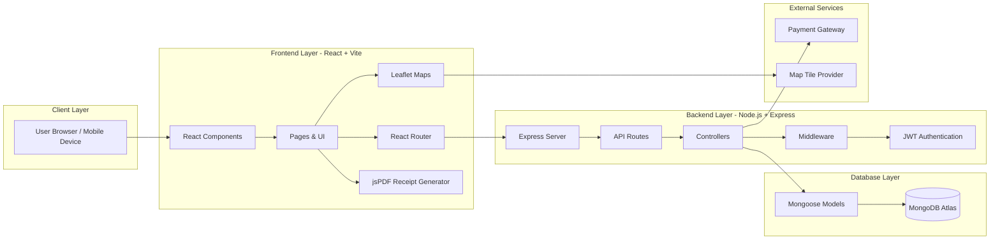
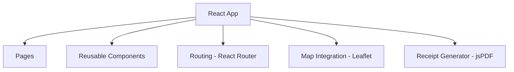
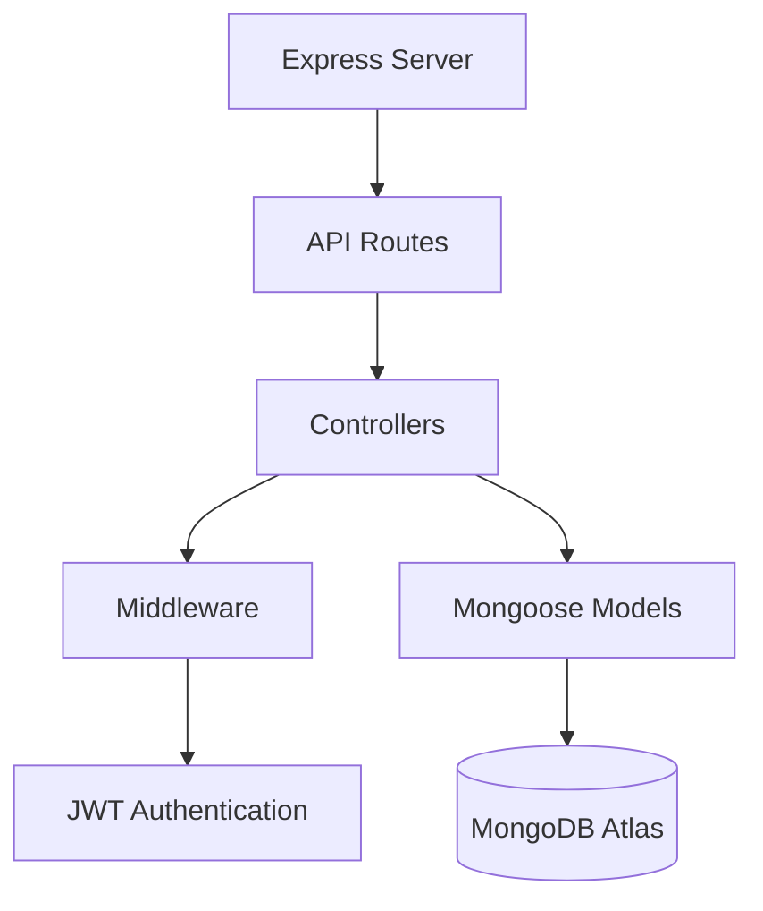
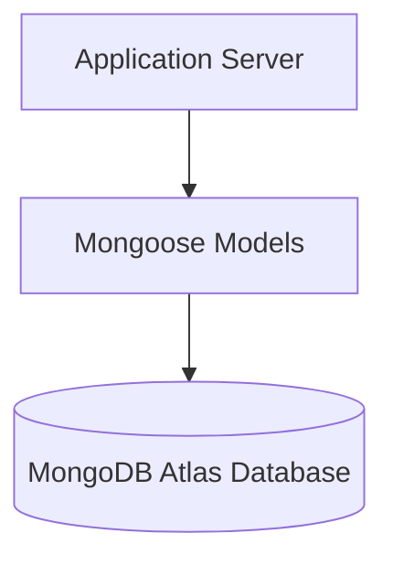
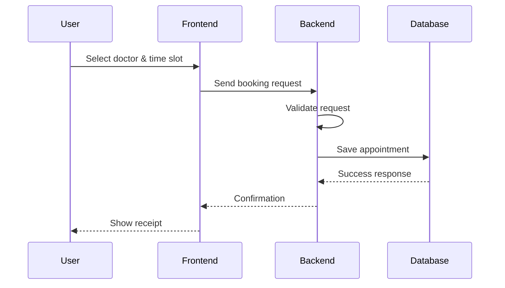
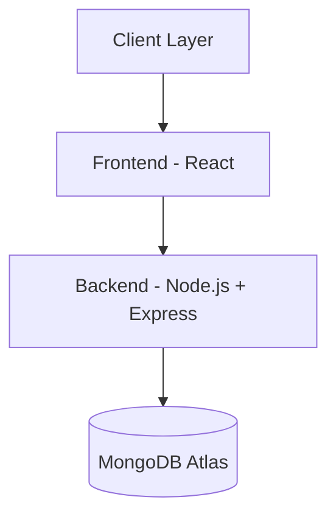
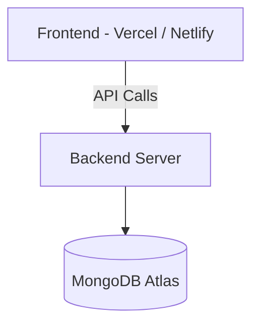

# 🏗️ Medify System Architecture

The **Medify Healthcare Clinic Booking Platform** follows a **MERN Stack Three-Tier Architecture** ensuring scalability, maintainability, and secure communication between system components.

---

# 📊 Overall Architecture Diagram

### Diagram



### Mermaid Code

```text
flowchart LR

subgraph Client["Client Layer"]
A[User Browser / Mobile Device]
end

subgraph Frontend["Frontend Layer - React + Vite"]
B[React Components]
C[Pages & UI]
D[React Router]
E[Leaflet Maps]
F[jsPDF Receipt Generator]
end

subgraph Backend["Backend Layer - Node.js + Express"]
G[Express Server]
H[API Routes]
I[Controllers]
J[Middleware]
K[JWT Authentication]
end

subgraph Database["Database Layer"]
L[(MongoDB Atlas)]
M[Mongoose Models]
end

subgraph External["External Services"]
N[Payment Gateway]
O[Map Tile Provider]
end

A --> B
B --> C
C --> D
C --> E
C --> F

D --> G

G --> H
H --> I
I --> J
J --> K

I --> M
M --> L

I --> N
E --> O
```

---

# 🧩 Architecture Layers

---

# 1️⃣ Client Layer

The **Client Layer** represents end users accessing the application through:

* Web browsers
* Mobile devices

Users interact with the platform to:

* Search clinics
* View doctor profiles
* Book appointments
* Make payments
* Manage bookings

Communication with the frontend occurs via **HTTP/HTTPS requests**.

---

# 2️⃣ Frontend Layer (React + Vite)

Responsible for **UI rendering and user experience**.

## Frontend Architecture Diagram



## Mermaid Code

```text
flowchart TD

A[React App]

A --> B[Pages]
A --> C[Reusable Components]
A --> D[Routing - React Router]
A --> E[Map Integration - Leaflet]
A --> F[Receipt Generator - jsPDF]
```

## Key Responsibilities

* UI rendering
* Client-side routing
* API communication
* Form handling
* Map visualization
* Receipt generation

## Major Technologies

| Technology    | Purpose           |
| ------------- | ----------------- |
| React 18      | UI library        |
| Vite          | Build tool        |
| Tailwind CSS  | Styling           |
| React Router  | Navigation        |
| Leaflet       | Maps              |
| React Leaflet | Map components    |
| jsPDF         | Generate receipts |

---

# 3️⃣ Backend Layer (Node.js + Express)

Handles **server-side logic and APIs**.

## Backend Architecture Diagram



## Mermaid Code

```text
flowchart TD

A[Express Server]

A --> B[API Routes]

B --> C[Controllers]

C --> D[Middleware]

D --> E[JWT Authentication]

C --> F[Mongoose Models]

F --> G[(MongoDB Atlas)]
```

## Key Responsibilities

* API request handling
* Authentication
* Appointment processing
* Input validation
* Clinic and doctor management
* Payment processing

## Backend Technologies

| Technology | Purpose          |
| ---------- | ---------------- |
| Node.js    | Runtime          |
| Express.js | Web framework    |
| JWT        | Authentication   |
| bcryptjs   | Password hashing |
| Joi        | Validation       |

---

# 4️⃣ Database Layer (MongoDB)

Stores all application data.

## Database Architecture



## Mermaid Code

```text
flowchart TD

A[Application Server]

A --> B[Mongoose Models]

B --> C[(MongoDB Atlas Database)]
```

## Main Collections

| Collection   | Description          |
| ------------ | -------------------- |
| Users        | Patients and clinics |
| Clinics      | Clinic information   |
| Doctors      | Doctor profiles      |
| Appointments | Booking records      |
| Reviews      | Feedback             |

---

# 🔄 Appointment Booking Flow



## Mermaid Code

```text
sequenceDiagram

participant User
participant Frontend
participant Backend
participant Database

User->>Frontend: Select doctor & time slot
Frontend->>Backend: Send booking request
Backend->>Backend: Validate request
Backend->>Database: Save appointment
Database-->>Backend: Success response
Backend-->>Frontend: Confirmation
Frontend-->>User: Show receipt
```

---

# 🌐 External Services

### Payment Gateway

Handles secure transactions.

Supported methods:

* UPI
* Debit/Credit Card
* Net Banking

### Map Provider

Used by **Leaflet Maps** for clinic location display.

---

# 📁 Architecture Type



---

# 🚀 Benefits

### Scalability

Frontend and backend scale independently.

### Maintainability

Clear separation of concerns.

### Security

JWT authentication and middleware validation.

### Performance

Fast builds with Vite.

### Flexibility

MongoDB allows dynamic schema design.

---

# 💻 Deployment Architecture



---

# 📌 Summary

Medify uses **modern MERN architecture** enabling:

* Fast UI
* Secure authentication
* Reliable booking system
* Scalable backend
* Cloud-based database
